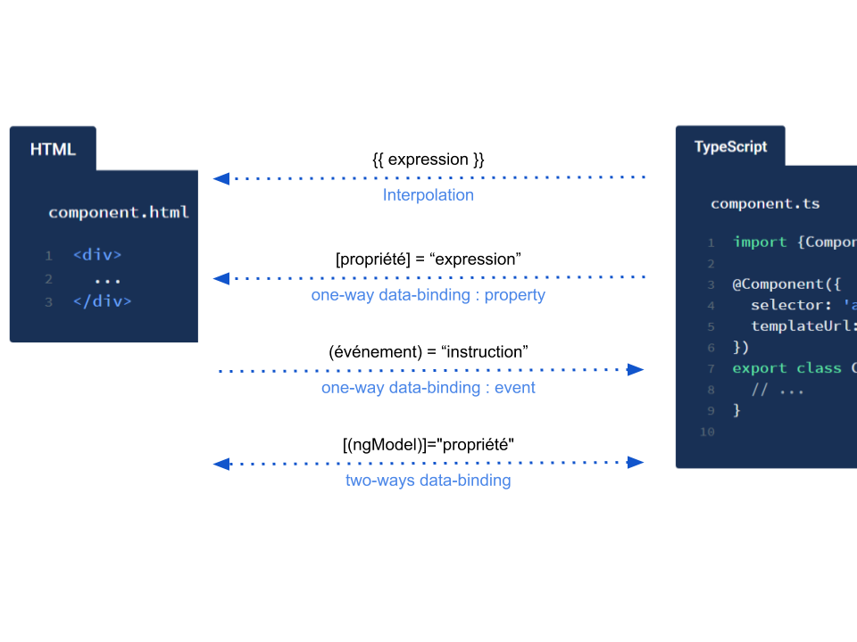

# Composants, templates et liaison de données \(data-binding\)

## L’interpolation

Data-Binding = lier une donnée entre la classe et le template

**Mis en pratique**


Actuellement nous avons :


```typescript
import { Component, OnInit } from '@angular/core';

@Component({
  selector: 'app-navbar',
  templateUrl: './navbar.component.html',
  styleUrls: ['./navbar.component.css']
})
export class NavbarComponent implements OnInit {

  constructor() { }

  ngOnInit() {
  }

}
```


Modifions notre composant en ajoutant la propriété _name_ à la classe et en lui attribuant une valeur.


```typescript
import { Component, OnInit } from '@angular/core';

@Component({
  selector: 'app-navbar',
  templateUrl: './navbar.component.html',
  styleUrls: ['./navbar.component.css']
})
export class NavbarComponent implements OnInit {

  name = 'Stéphane';

  constructor() {
  }

  ngOnInit() {
  }

}
```


Modifions le template pour afficher la nouvelle propriété.


```markup
Hello {{name}}
```



Nous venons de faire le lien entre classe et template de notre composant.

Le data-binding est en temps réel :


```typescript
constructor() {
  setTimeout(() => this.name = 'Arthur', 2000); // -> ?
}
```


## Les mécanismes d’interaction entre composants

### Interaction du parent vers l'enfant

Nous allons envoyer une donnée d'un composant parent à un composant enfant.


**Mise en pratique** \(ensemble, pas à pas dans l'IDE\)

* Modifier`name = '';` dans navbar.component.ts
* Ajouter `@Input()` pour cette propriété `name`
* Normalement, l'IDE nous rajoute `import {Input} from '@angular/core';`
* Ajouter `<app-navbar name="Bob"></app-navbar>` dans app.component.html
* Vérifier que cela fonctionne


La donnée _'Bob'_ qui était uniquement contenue dans _AppComponent_ est maintenant également disponible dans _NavbarComponent_, son composant enfant.

### Property binding \(liaison de propriété\)

Si on veut mettre une variable à la place de _'Bob'_, comment faire ?


**Mise en pratique** \(ensemble, pas à pas dans l'IDE\)

* Ajouter la propriété `name = 'Stephane';` dans app.component.ts
* Ajouter `<app-navbar [name]="name"></app-navbar>` dans app.component.html
* Vérifier que cela fonctionne


Nous venons de créer une liaison complète d'une propriété entre un composant parent et son enfant.

### Interaction de l'enfant vers le parent

Dans ce sens d'interaction, ce n'est plus simplement une donnée que l'on envoi, mais d'abord un événement.

Définition d’un événement :

* Quelque chose qui peut se produire.
* On doit attendre que l'événement se produise \(on l'écoute\)

Exemple d'événements : clic de souris, mouvement de souris, touche du clavier appuyée...

Ces événements peuvent être écoutés, et lorsqu'ils se produisent, on peut exécuter une action.


**Mise en pratique** \(ensemble\)

* Créer _SearchComponent_, dépendant du _NavbarModule_

```bash
ng generate component navbar/search
```

* Ajoutons un champ de recherche dans le template du _searchComponent_


```markup
<input (input)="sendCriteria($event.target.value)">
```


* Se placer dans le fichier _src/app/navbar/search/search.component.ts_
* Ajouter la propriété _@Output\(\) search: EventEmitter&lt;string&gt; = new EventEmitter\(\);_
* Remarquez que _Output_ a été ajouté par l'IDE dans les _import_
* Ajouter dans la méthode _sendCriteria\(\)_ : _this.search.emit\(value\);_

Récupérons ce qui a été émis par le composant search.

* Se placer dans le fichier _src/app/navbar/navbar.component.html_
* Ajouter l'appel à _SearchComponent_ avec un event binding


```markup
<app-search (search)="onSearch($event)"></app-search>
```


* Se placer dans _src/app/navbar/navbar.component.ts_
* Créons la méthode onSearch qui va réagir à l'événement


```typescript
import {Component, EventEmitter, Input, OnInit} from '@angular/core';

@Component({
  selector: 'app-navbar',
  templateUrl: './navbar.component.html',
  styleUrls: ['./navbar.component.scss']
})
export class NavbarComponent implements OnInit {

  @Input() name: string;

  constructor() {
  }

  ngOnInit() {
  }
  
  showChanges(criteria: string): void {
    console.log(criteria)
  }

}
```



Si l'on test, la console devrait afficher notre critère à chaque frappe sur le clavier.

Nous venons de faire transiter l'événement du _SearchComponent_ vers le _NavbarComponent_.

#### Propagation de l'événement _search_ dans notre application

Pour pouvoir filtrer la liste des utilisateurs en fonction de notre critère saisi, il faut continuer de faire remonter la mise à jour dans AppComponent et ensuite la faire redescendre dans UsersComponent.


**Mise en pratique**

* Envoyer l'événement _searchChange_ depuis le composant _navbar_
* Récupérer l'événement _searchChange_ dans le composant _app_ 
* Envoyer la donnée _criteria_ au _UsersComponent_ grace à un paramètre _search_
* Utiliser _search_ dans le _UsersComponent_ pour l'afficher dans le template


### Le two-way data-binding dans un composant \(lien à double-sens entre les données\)

Le two-way data-binding consiste à mettre à jour une variable peu importe où l'information a été modifiée. 

Par exemple, si nous avons le nom de l'utilisateur affiché sur les deux composants A et B. Si on modifie le nom sur A, il le sera aussi sur B et réciproquement. 

Voici un exemple de two-way data-binding :


```typescript
export class Component {
  name: string;
  // ...
}
```



```markup
<input [value]="name" (input)="name=$event.target.value">
```


On utilise plutôt l'écriture simplifiée du two-way data-binding, grâce à `ngModel`, beaucoup plus pratique !


```markup
<input [(ngModel)]="name">
```


Cette dernière écriture fait exactement la même chose que la précédente.


Pour pouvoir utiliser `ngModel`, Il faut absolument importer `FormsModule`.



**Mise en pratique**

Nous souhaitons que le champ de recherche puisse être réinitialisé par un bouton "Clear".


```typescript
import {FormsModule} from '@angular/forms';

@NgModule({
  declarations: [NavbarComponent, SearchComponent],
  imports: [
    CommonModule,
    FormsModule
  ],
  exports: [NavbarComponent],
})
export class NavbarModule {
}
```


Mise en évidence du two-way data-binding :


```markup
<input [(ngModel)]="criteria" (input)="sendCriteria()">
<p>Ma recherche : {{criteria}} !</p>
```


Implémentation du clear :


```markup
<input [(ngModel)]="criteria" (input)="sendCriteria()">
<button (click)="criteria=''">Clear</button>
<p>Ma recherche : {{criteria}} !</p>
```


Meilleure implémentation :


```markup
<input [(ngModel)]="criteria" (input)="sendCriteria()">
<button (click)="clearCriteria()">Clear</button>
```



```typescript
  sendCriteria() {
    this.search.emit(this.criteria);
  }
  
  clearCriteria() {
    this.criteria = ''
    this.sendCriteria()
  }
```



## Résumé sur l'interpolation et les différents binding de données

Il existe 4 types de lien
 :



## Angular Elements

Les éléments Angular sont des composants d'Angular regroupés sous forme de Web Component, la norme Web permettant de définir de nouveaux éléments HTML de manière indépendante du framework.


Les Web Components sont actuellement pris en charge par Chrome, Firefox, Opera et Safari, et disponible dans d'autres navigateurs via des polyfills. Un Web Component étend HTML en vous permettant de définir une balise dont le contenu est créé et contrôlé par du code JavaScript.

Le package @angular/elements exporte une API createCustomElement \(\) qui fournit un pont entre le composant Angular et le navigateur.

```markup
<my-popup message="Use Angular!"></my-popup>
```

Pour consulter une implémentation d'un Angular Element : [https://angular.io/guide/elements](https://angular.io/guide/elements)

