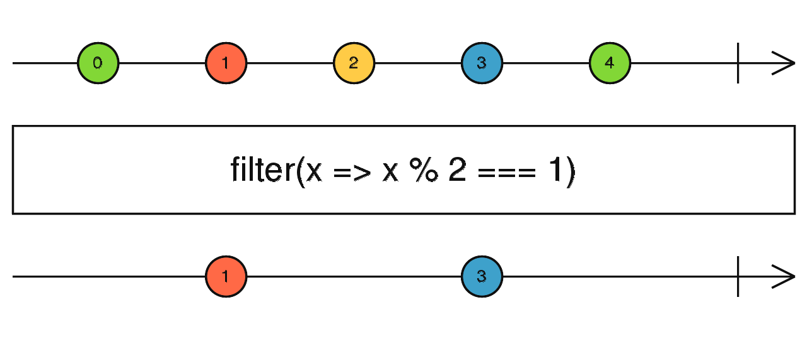
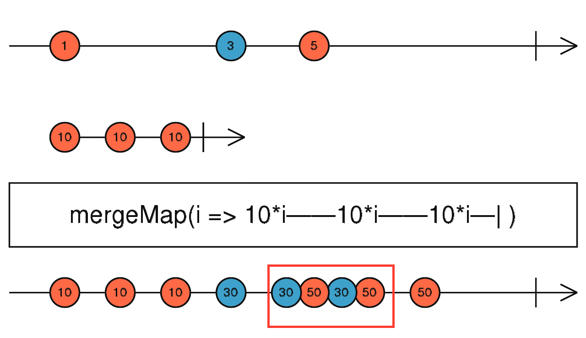
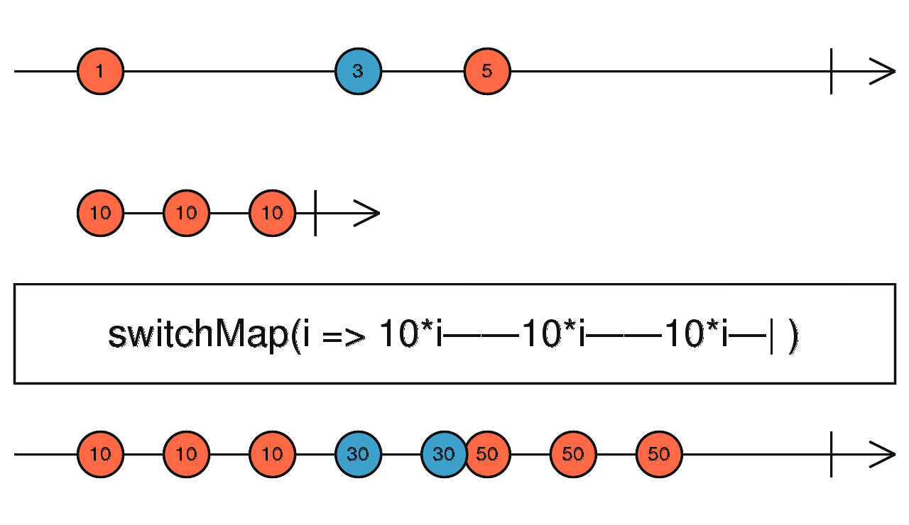

# Les Observables et la bibliothèque RxJS

La combinaison des Promises avec Async / Await est puissante mais ne répond pas encore à tous les cas d'utilisation.

Pour dépasser les limites des promesses pour les traitements asynchrones, Angular se base principalement sur le concept d'Observables ou plus généralement le Reactive Programming.

En attendant la standardisation des Observables, Angular utilise la librairie RxJS.

**Promise vs Observable**

| `Promise` | `Observable` |
| :--- | :--- |
| Produit une seule valeur. | Produit un "stream" de valeurs _\(potentiellement infini\)_. |
| Non annulable. | Annulable. |
| Traitement immédiat. | Lazy : le traitement n'est déclenché qu'à la première utilisation du résultat. |
| Deux méthodes uniquement \(then/catch\). | Une centaine d'opérateurs de transformation natifs. |

## Concepts de programmation réactive

La programmation réactive se base sur le concept d'[observateur](https://fr.wikipedia.org/wiki/Observateur_%28patron_de_conception%29) \(Design pattern\). Le principe est simplement que l'on définit des **observables** et des **observateurs**. Les observables vont émettre des événements qui seront interceptés par les observateurs.

La programmation réactive va étendre ce concept en permettant de combiner les observables, modifier les événements à la volée, les filtrer, les combiner...

## Angular et RxJS \(Reactive Extensions for JavaScript\)

RxJS est la version javascript de **ReactiveX**, l’implémentation la plus connues des `Observable` \(disponible dans différents langages, **RxPython**, **RxJava**, **Rx.NET, RxPHP,** etc...\)

## Comprendre et utiliser les observables et observateurs

### Subscribe

Dans l'exemple ci-dessous nous allons créer un observable à l'aide de la fonction `interval` qui produit une **valeur auto-incrémentée de façon régulière**. 

```typescript
import { interval } from 'rxjs';

const data$ = interval(1000);
```

Tant qu'on ne s'inscrit pas à l'observable, il ne se passe rien.


La convention de nommage est de suffixer les "observables" avec `$`.


Le point commun entre tous les observables est la méthode `subscribe` qui permet de **souscrire à un `Observable`** et être **notifié des nouvelles valeurs**, des **erreurs** ou de la **fin du flux**.

```typescript
import { interval } from 'rxjs';
​
const data$ = interval(1000);

data$.subscribe(value => console.log(value));
```


Nous pouvons ensuite ajouter les callbacks de capture d'erreur ou de fin du flux en passant un objet à la méthode subscribe avec les trois callbacks suivantes : `next`, `error` et `complete`.

```typescript
data$.subscribe({
    next: value => console.log(value),
    error: err => console.error(err),
    complete: () => console.log('DONE!')
});
```

### Unsubscribe

La méthode `subscribe` retourne un objet de type `Subscription`. 

```typescript
import { interval } from 'rxjs';
​
const data$ = interval(1000);

const subscription = data$.subscribe({
    next: value => console.log(value),
    error: error => console.error(error),
    complete: () => console.log('DONE!')
});
```

Cet  objet sert principalement à se désinscrire d'un `Observable`  via sa méthode `unsubscribe`.

```typescript
subscription.unsubscribe();
```

La méthode `unsubscribe` va donc :

* **désinscrire les callbacks** : `next`, `error` et  `complete`
* éventuellement **libérer la mémoire** car en désinscrivant les callbacks, le "garbage collector" libérera la mémoire occupée par les objets référencés dans les callbacks _\(s'ils ne sont plus référencés ailleurs\)_.


Il est important de désinscrire les Observables dès qu'il n'y en a plus besoin afin d'éviter les **fuites mémoire**, la **consommation inutile de CPU** et les **effets de bord** associés à ces Observables "zombies".


L'`unsubscribe` se fait généralement :

* lors de la destruction d'un composant via le "lifecycle hook" **`ngOnDestroy`**,
* ou lorsqu'un `Observable` doit en remplacer un autre _\(e.g. : lancement d'une nouvelle recherche par un utilisateur ou rafraichissement du contenu\)_.

### Création d'un Observable

Il est rare de devoir créer un `Observable` "from scratch" car Angular fournit généralement des "wrappers" à base d'`Observable` pour la plupart des sources de données asynchrones _\(http, forms, route changes etc...\)_ mais il est intéressant de s'y aventurer au moins une fois pour mieux en comprendre le fonctionnement.

L'exemple suivant :

```typescript
import { Observable } from 'rxjs';

const data$ = new Observable(observer => {

    observer.next(1);
    observer.next(2);
    observer.next(3);
    observer.complete();

});

data$.subscribe({
    next: value => console.log(value),
    error: err => console.error(err),
    complete: () => console.log('DONE!')
});
```

... produit le résultat :

```bash
1
2
3
DONE!
```

### Erreurs

La méthode `error` permet de déclencher une erreur.

```typescript
import { Observable } from 'rxjs';

const data$ = new Observable(observer => {

    observer.next(1);
    observer.next(2);
    observer.error(new Error('Oups!'));
    observer.next(3);
    observer.complete();

});

data$.subscribe({
    next: value => console.log(value),
    error: error => console.error(error.toString()),
    complete: () => console.log('DONE!')
});
```

```bash
1
2
Error: Oups!
```


Une fois les méthodes `error` ou `complete` appelées, les appels suivants aux méthodes `next`, `error` et `complete` sont simplement ignorés.


## Gestion des requêtes HTTP avec l’API HttpClient

Dans une application Angular, la plupart des données proviennent d'API ReST où les échanges de données se font via des requêtes HTTP.

Pour produire des requêtes HTTP, Angular fournit un service `HttpClient`.

### Pourquoi HttpClient ?

Le service `HttpClient` a pour avantages de :

* **simplifier** l'implémentation d'échanges HTTP,
* fournir les **outils** nécessaires pour faciliter l'implémentation des "**tests unitaires**",
* se baser sur les **`Observable`**s permettant ainsi :
  * **d'annuler les requêtes** si nécessaire,
  * de suivre la **progression** d'"upload" et de "download",
  * d'implémenter des **wrappers** permettant de produire une réponse à partir d'un résultat temporaire en cache puis le résultat reçu depuis l'API.

### Utilisation de HttpClient

#### 1. Injection du service `HttpClient`

`HttpClient` est un service Angular ; on peut donc le récupérer avec l'injection de dépendance.



```typescript
import { Component } from '@angular/core';
import { HttpClient } from '@angular/common/http';

@Component({
    selector: 'wt-book-search',
    templateUrl: './book-search.component.html'
})
export class BookSearchComponent {

    constructor(private httpClient: HttpClient) {
    }

}
```




On obtient l'erreur suivante `No provider for HttpClient!` car le service `HttpClient` n'est pas encore Tree-Shakable et il faut donc importer le module associé `HttpClientModule`.




```typescript
import { HttpClientModule } from '@angular/common/http';

@NgModule({
    declarations: [
        BookPreviewComponent,
        BookSearchComponent
    ],
    exports: [
        BookPreviewComponent,
        BookSearchComponent
    ],
    imports: [
        HttpClientModule,
        SharedModule
    ]
})
export class BookModule {
}
```



#### 2. Exécution de la requête

Nous pouvons donc récupérer les données par API dans le `ngOnInit`.



```typescript
import { Component, OnInit } from '@angular/core';
import { HttpClient } from '@angular/common/http';

@Component({
    selector: 'wt-book-search',
    templateUrl: './book-search.component.html'
})
export class BookSearchComponent implements OnInit {

    private bookListUrl = 'https://www.googleapis.com/books/v1/volumes?q=extreme%20programming';

    constructor(private httpClient: HttpClient) {
    }

    ngOnInit() {
        this.httpClient.get(this.bookListUrl);
    }

}
```



#### Déclenchement de la requête au `subscribe`

En inspectant le comportement du "browser“, on peut remarquer que **la requête n'est pas envoyée**.

En effet, les méthodes `get`, `delete`, `patch`, `post`, `put`, `request` etc... **retournent toujours un `Observable`.**

Cet `Observable` est "lazy" et il faut donc `subscribe` pour déclencher le traitement.

### Utilisation dans un Service


Le service `HttpClient` ne devrait pas être utilisé directement depuis les composants.

Il faut "wrapper" l'interaction avec les APIs dans des **services dédiés** et **réutilisables**.


Il nous faudrait donc un service que l'on puisse utiliser ainsi depuis nos composants :

```typescript
bookRepository.getBookList()
    .subscribe(bookList => this.bookList = bookList);
```

#### Transformation de la réponse avec un opérateur

Ce service retourne un `Observable`. La **transformation** des données doit donc se faire **avec un opérateur dans le service**.


**Mise en pratique**

Modifions le `UserService` pour qu'il ne retourne plus une `Promise` mais un `Observable`.

* Utilisons le service `HttpClient` dans notre `UserService`.
* Importons le `HttpClientModule` dans `UsersModule`.
* Modifions le `UsersComponent`.


```typescript
import {Injectable} from '@angular/core';
import {Observable} from "rxjs";
import {HttpClient} from "@angular/common/http";

@Injectable({
  providedIn: 'root'
})
export class UsersService {

  url = 'https://jsonplaceholder.typicode.com/users';

  constructor(private http: HttpClient) {
  }

  get$(): Observable<User[]> {
    return this.http.get<User[]>(this.url);
  }

}
```



```typescript
  ngOnInit() {
    this.usersService.get$().subscribe(result => this.users = result);
  }
```


Pour continuer à avoir add et remove qui fonctionnent sur la liste des utilisateurs, il faut déporter la logique de ces 2 méthodes dans le component.


#### Astuce : n'oubliez pas les metadata

Idéalement, pour faciliter l'extensibilité et la gestion de la pagination, pensez à produire un objet englobant la liste ainsi que les "metadata" associées _\(pagination etc...\)_.

```typescript
import { Observable, of } from 'rxjs';
import { map } from 'rxjs/operators';

interface ListResponse<T> {
    meta: {
        totalCount: number
    };
    itemList: T[];
}

class BookRepository {

    getBookList() {
        return this.getBookListWithMeta()
            .pipe(map(bookListResponse => bookListResponse.itemList));
    }

    getBookListWithMeta(): Observable<ListResponse<Book>> {
        return of({
            meta: {
                totalCount: 100
            },
            itemList: [
                new Book(),
                new Book()
            ]
        });
    }

}

new BookRepository().getBookListWithMeta()
    .subscribe(bookListResponse => {
        const bookCount = bookListResponse.meta.totalCount;
        const bookList = bookListResponse.itemList;
    });
```

### Gestion avancée de la Subscription

Dans les exemples ci-dessus, l'objet `Subscription` retourné par la méthode `subscribe` est simplement ignoré.


Il faut s'assurer que **le composant `unsubscribe` de l'`Observable` avant sa destruction** _\(et également si une nouvelle requête est déclenchée par exemple en cas de "refresh"\)_.

Dans le cas d'`Observable`s infinis cela **évite des fuites mémoire et surconsommation CPU**.

Dans notre cas, cela **évite la congestion des requêtes HTTP** _\(dans le cas où le composant est détruit et reconstruit plusieurs fois rapidement par exemple ou encore lors de la navigation sur l'application via le_ [_Routing_]()_\)._


#### `Unsubscribe` dans `ngOnDestroy`

On profite généralement du "Lifecycle Hook" `ngOnDestroy` pour déclencher l'`unsubscribe`.



```typescript
export class BookSearchComponent implements OnInit, OnDestroy {
    private bookListSubscription: Subscription;
    
    constructor(private bookRepository: BookRepository) {
    }
    
    ngOnInit() {
        this.bookListSubscription = this.bookRepository.getBookList()
            .subscribe(bookList => this.bookList = bookList);
    }
    
    ngOnDestroy() {
        this.bookListSubscription.unsubscribe();
    }
}
```



Et par précaution dans le cas où la `subscription` est créé plus tard.



```typescript
ngOnDestroy() {
    if (this.bookListSubscription != null) {
        this.bookListSubscription.unsubscribe();
    }
}
```



**L'inconvénient** de cette approche est sa **verbosité**. **Elle en devient source d'erreurs**.

#### Meilleure solution : `Unsubscribe` avec l'opérateur `takeUntil`



```typescript
import takeUntil from 'rxjs/operators';

export class BookSearchComponent implements OnDestroy, OnInit {

    bookList: Book[];

    private isDead$ = new Subject();

    constructor(private bookRepository: BookRepository) {
    }

    ngOnInit() {
        this.bookRepository.getBookList()
            .pipe(takeUntil(this.isDead$))
            .subscribe(bookList => this.bookList = bookList);
    }

    ngOnDestroy() {
        this.isDead$.next();
    }

}
```



### Unsubscribe avec le Pipe `async`

Dans les cas les plus simples, cette approche est la plus adaptée car c'est **la moins verbeuse** est **la plus réactive**.

Le "pipe" `async` permet de `préparer l'Observable dans le composant` et laisser **la vue `subscribe` quand elle en a besoin et si elle en a besoin**.



```typescript
export class BookSearchComponent {

    bookList$: Observable<Book[]>;

    constructor(private bookRepository: BookRepository) {
        this.bookList$ = this.bookRepository.getBookList();
    }

}
```



Remarquez que l'**on se permet de créer l'`Observable` directement dans le constructeur**. En effet, tant que l'on ne `subscribe` pas, aucun traitement n'est déclenché.

#### Fonctionnement du "pipe" `async`



```markup
<wt-book-preview
        *ngFor="let book of bookList$ | async"
        [book]="book"></wt-book-preview>
```



Le "pipe" `async` **`subscribe` à l'`Observable` `bookList$`** et **permet de mettre à jour la vue en conséquence**.

A la destruction de l'élément _\(e.g. : "toggle" de la liste via `*ngIf`\)_, **le "pipe" `async` `unsubscribe` automatiquement**.


**Mise en pratique**


```markup
<p *ngFor="let user of users | async | filter : search">
  {{user.name}} : {{user.age}}
</p>
```



```typescript
import {Component, Input} from '@angular/core';
import {UsersService} from './users.service';
import {Observable, of} from 'rxjs';

@Component({
  selector: 'app-users',
  templateUrl: './users.component.html',
  styleUrls: ['./users.component.scss']
})
export class UsersComponent {
  usersService: UsersService;
  users: Observable<User[]> = of([]);
  @Input() search: string;

  constructor(usersService: UsersService) {
    this.users = this.usersService.get();
  }

}
```



## Les principaux opérateurs

### Définition d'un Opérateur

`RxJS` fournit nativement plus d'une centaine d'opérateurs.

Un opérateur permet de définir un `Observable` à partir d'un autre en y **appliquant quelques transformations**.

Les opérateurs sont des fonctions que l'on peut appliquer à un `Observable` via la méthode `pipe`.

```typescript
import { interval } from 'rxjs';
import { map } from 'rxjs/operators';

const value$ = interval(1000);
const decuple$ = value$.pipe(map(value => value * 10));
```

### Map

L'opérateur `map` permet de créer un nouvel `Observable` à partir de l'`Observable` d'origine en transformant simplement chacune de ses valeurs.


```typescript
import { from } from 'rxjs';
import { map } from 'rxjs/operators';

const connectedId$ = from([5, 10, 3]);

const connectedUser$ = connectedId$.pipe(
    map(id => userService.getUser(id))
  ); // seulement si getUser est synchrone

connectedUser$.subscribe(user => console.log(user.name));
```

Résultat :

```bash
Chelsey Dietrich
Clementina DuBuque
Clementine Bauch
```


**Mise en pratique**

A partir de la liste de `User` qu'on reçoit dans le `userService`, on veut pouvoir afficher l'adresse des utilisateurs grâce à un nouvelle propriété `address.fullAddress` qui va contenir leur adresse complète.


### Filter

L'opérateur `filter` permet de ne garder que les éléments pour lesquels la fonction `predicate` retourne `true`.



```typescript
import { from } from 'rxjs';
import { filter } from 'rxjs/operators';
​
const friends = ['Clementine Bauch']

const connectedId$ = from([5, 10, 3]);
​
const connectedFriends$ = connectedId$
  .pipe(
    map(id => userService.getUser(id),
    filter(user => friends.includes(user.name)),
  );
​
connectedFriends$.subscribe(user=> console.log(user));
```

Résultat :

```bash
Clementine Bauch
```

## Transformer plusieurs observables en un seul

### MergeMap

L'opérateur mergeMap produit la fusion des flux.

A chaque nouvelle valeur, elle est immédiatement reflétées dans la sortie.



```typescript
import { from, interval, mergeMap, switchMap, zip } from 'rxjs';
import { map } from 'rxjs/operators';

const getUserConnection = () => {
    /* Produit une connexion à partir du tableau chaque seconde. */
    return zip(
        from(['Eva', 'Aude', 'Anne', 'Marc']),
        interval(1000)
    )
        .pipe(map(([name]) => name));
};

const getActivity = user => {
    /* Envoi une réaction "j'aime" chaque 400ms. */
    return interval(400)
        .pipe(map(() => `${user} envoi un like`));
};
```

Le code suivant :

```typescript
getUserConnection().subscribe(user => console.log(user));
```

... produit donc le résultat :

```bash
# à 1s
Eva
# à 2s
Aude
# à 3s
Anne
# à 4s
Marc
```

Et le code suivant :

```typescript
getActivity('Eva').subscribe(message => console.log(message));
```

... produit :

```bash
Eva envoi un like # at  400ms
Eva envoi un like # at  800ms
Eva envoi un like # at 1200ms 
# ... même valeur indéfiniment.
```

#### `mergeMap`

L'opérateur `mergeMap` produit un `Observable` pour chaque valeur de l'`Observable` d'origine. Les Observables ainsi obtenus sont fusionnés \(merge\).

```typescript
const userActivity$ = getUserConnection()
    .pipe(mergeMap(user => getActivity(user)));

userActivity$
    .subscribe(message: string => console.log(message));
```

On obtient le résultat suivant :

```bash
# à 1000ms, Eva se connecte
Eva envoi un like # à 1400ms
Eva envoi un like # à 1800ms
# à 2000ms, Aude se connecte
Eva envoi un like # à 2200ms
Aude envoi un like # à 2400ms
Eva envoi un like # à 2600ms
Aude envoi un like # à 2800ms
# à 3000ms, Anne se connecte
Eva envoi un like # à 3000ms
Aude envoi un like # à 3200ms
Anne envoi un like # à 3400ms
Eva envoi un like # à 3400ms
Aude envoi un like # à 3600ms
Anne envoi un like # à 3800ms
Eva envoi un like # à 3800ms
# ...
```


Dans la plupart des cas, nous préférerons utiliser `switchMap` à `mergeMap` pour éviter le comportement décrit ci-dessous.

Toutefois, il existe des cas d'utilisation où il faut absolument préférer `mergeMap` à `switchMap` pour éviter d'annuler certains traitements en cours lorsqu'une nouvelle valeur est produite.


### `switchMap`

Contrairement à `mergeMap`, quand l'`Observable` d'origine produit une nouvelle valeur, `switchMap` va `unsubscribe` de l'`Observable` produit par la valeur précédente avant de `subscribe` à l'`Observable` produit par la nouvelle valeur.



Voici le même exemple que le précédent mais avec `switchMap` cette fois-ci.

```typescript
const userActivity$ = getUserConnection()
    .pipe(switchMap(user => getActivity(user)));

userActivity$
    .subscribe(message => console.log(message));
```

Le résultat devient :

```bash
# à 1000ms, Eva se connecte
Eva envoi un like # à 1400ms
Eva envoi un like # à 1800ms
# à 2000ms, Aude se connecte
Aude envoi un like # à 2400ms
Aude envoi un like # à 2800ms
# à 3000ms, Anne se connecte
Anne envoi un like # à 3400ms
Anne envoi un like # à 3800ms
# ...
```

