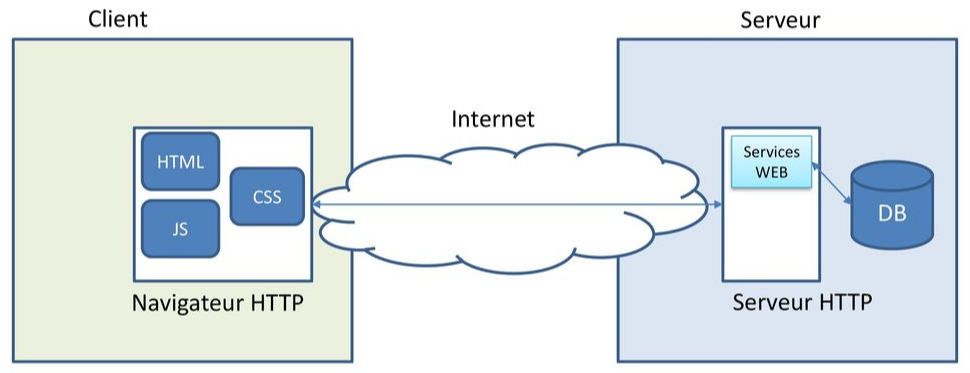

# Présentation d'Angular

## Décryptage de la philosophie voulue par Google

La plupart du temps, la SPA discute avec une API, coté serveur, afin de récupérer les données à afficher. Très souvent, l'API est REST \(REpresentational State Transfer\) : architecture pour créer des services web.




Lors du développement de nos applications, nous allons coder une multitude de petits composants, qui une fois assemblés tous ensembles, constitueront une application à part entière.

Un composant c'est quoi ? un morceau de code HTML/CSS, et d’une classe JavaScript dédiée à une tâche particulière.

### Web Component

Définition :

* Balise HTML personnalisée
* Brique indépendante et facilement réutilisable

#### Basé sur 4 spécifications W3C :

* Custom elements \(éléments personnalisés\)
* Template
* Shadow DOM \(Document Object Model\) : isolation du CSS et JS entre le composant et le reste de la page
* import javascript

Ces 4 fonctionnalités ne sont pas présentes sur tous les navigateurs, il faut alors utiliser un [polyfill](https://fr.wikipedia.org/wiki/Polyfill).

L'encapsulation est un aspect important des composants Web :

Cela permet de garder la structure, le style et le comportement du balisage cachés et distincts des autres codes de la page, de sorte que les différentes parties ne se heurtent pas et que le code reste propre et net. L’API de DOM Shadow permet d’attacher un DOM séparé et caché à un élément.



```markup
...
<template id="my-component">
  <h1>Mon titre</h1>
  <p>Mon paragraphe</p>
</template>
...
<div class="color-red">
  <my-component></my-component>
</div>
...
```





```markup
...
<div class="color-red">
  <h1>Mon titre</h1>
  <p>Mon paragraphe</p>
</div>
...
```



## Les apports d’Angular dans le monde du développement web

### Développer pour toutes les plateformes

Créer des applications avec Angular et de réutiliser votre code pour créer des applications pour le Web, le Web mobile \(responsive et PWA\), le mobile natif \(Ionic\) et le bureau natif \(Electron ou Webkit\).

### Vitesse et performance

Bonne vitesse exécution sur la plate-forme Web \(allez plus loin, via Web Workers et le rendu côté serveur\).

### Grande communauté



### Google

Angular est utilisé pour les applis Google.

## Versions : AngularJS à Angular

Angular 1, renommé AngularJS, a une architecture MVC \(Model Vue Controller\), non compatible avec les versions suivantes, 2 et plus \(architecture composants\).

Angular 2+ : compatible versions suivantes

