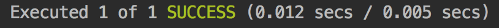
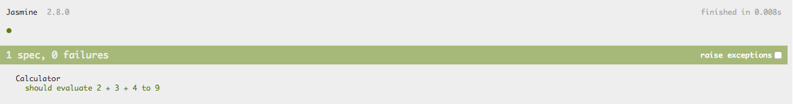
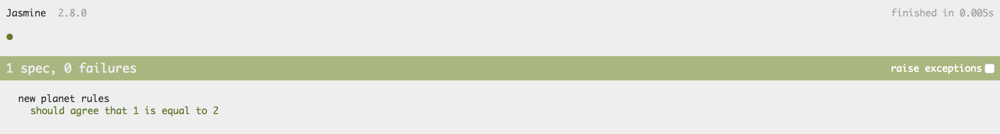
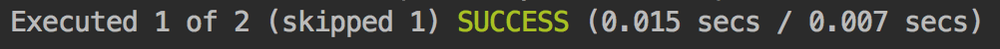

# Tests

### Pourquoi Tester ?

#### Le coût du changement

Sans tests, le coût du changement augmente exponentiellement.

En l'absence de tests _\(ou s'ils sont simplement insuffisants\)_, il est **difficile d'évaluer si l'application fonctionne** comme attendu. Il devient **nécessaire de tester l'application manuellement à chaque changement** ; ****mais comment choisir les parties à tester et quels effets de bord attendre de chaque changement ?  
L'équipe finit par **éviter le changement pour éviter les régressions**.

#### Cross-Browser et Cross-Platform

Les tests manuels peuvent s'avérer très rapidement coûteux, particulièrement si l'on souhaite découvrir les anomalies spécifiques à certains navigateurs ou "devices" avant l'utilisateur final.

#### Pas de tests, pas d'update

Une application Angular a généralement quelques **millions de lignes de code** en dépendance.  
**Chaque jour**, un peu moins d'**une dizaine** de ces dépendances sont mises à jour.  
**Comment profiter des mises à jour sans introduire de régressions** ?

#### "Tests are Specs"

Les tests forment à la fois les spécifications et la documentation de l'application.

Pour découvrir _\(ou mieux comprendre\)_ certaines fonctionnalités non documentées _\(ou dont la documentation n'est pas à jour\)_ d'un module open-source _\(e.g. Angular\)_, les tests s'avèrent très intéressants comme source d'information.

Contrairement à des spécifications ou documentations, les tests ont l'avantage d'être toujours à jour.

## Configurer l’environnement de test

Grâce à Angular CLI, **tous les outils** nécessaires à l'implémentation et l'exécution des tests unitaires **sont installés et pré-configurés** dès la création de l'application. Cf. fichier `karma.conf.js`.

## Karma et Jasmine

### Exécution des Tests

La commande **`npm test`** permet de déclencher la commande Angular CLI **`ng test --watch`**.


L'option `--watch` permet de relancer les tests unitaires **à chaque changement dans le code**.

Cela permet de **s'assurer en temps réel** que les développements en cours n'ont **pas d'effets négatifs sur les tests existants** et également de savoir **quand la fonctionnalité est opérationnelle**.

Pour lancer les tests sur un environnement d'**intégration continue**, pensez à ajouter une commande dédiée dans les `scripts` du `package.json` :

```javascript
"scripts": {
    "test": "ng test --watch",
    "test:singlerun": "ng test --code-coverage"
}
```


La commande `ng test` lance les tests unitaires en utilisant **Karma**.

Karma est un outil permettant de **configurer** et d'**interconnecter** simplement les différents éléments nécessaires à la mise en place de tests unitaires frontend : "**watch**" des changements, "**build**" des tests, **exécution** des tests sur les "browsers", "**debug**", "**reporting**", "**code coverage**" etc...

### Fonctionnement de Karma

Au lancement des tests :

1. Karma **déclenche un serveur** permettant de communiquer avec les "browsers" _\(généralement sur :_ [_http://localhost:9876_](http://localhost:9876)_\)_,
2. Karma **déclenche les "browsers" demandés** qui se connectent sur le serveur Karma,
3. Karma "**watch**" les changements du **code source** des tests unitaires et récursivement des fichiers importés depuis ces tests,
4. à chaque changement, Karma **déclenche le "build"** du code source modifié,
5. à chaque build, **Karma émet un événement aux "browsers"** connectés par WebSocket pour les informer du changement et **demander l'exécution des tests**,
6. les tests sont exécutés sur le "browser" et les résultats sont transmis au serveur Karma,
7. Karma **produit les rapports** en fonction des plugins activés : console, HTML, "code coverage" etc...


Par défaut, tous les fichiers `.spec.ts` contenus dans le dossier `src` sont importés pour être exécuter. Cf. `src/test.ts`.


### Jasmine

Pour JavaScript, c'est l'équivalent de JUnit en Java ou NUnit en dotNet.

Il inclut tout le nécessaire pour :

* définir des suites de tests _\(fonctions `describe` et `it`\)_,
* implémenter des assertions de toute sorte _\(fonction `expect`\)_,
* implémenter rapidement des "Spies" _\(alias mocks\) \(fonctions `createSpy`, `createSpyObj` et `spyOn`\)._

### Test unitaire synchrone

#### Ajout d'un Test

Pour ajouter un test, il suffit de créer un fichier avec l'extension `.spec.ts` dans le dossier `src`. Plus exactement, **la convention est de créer ce fichier dans le même dossier que le fichier contenant le code source à tester**.

Il suffit d'utiliser les 3 fonctions suivantes pour implémenter un premier test :

* `describe` : pour définir une suite _\(ou groupe\)_ de "specs".
* `it` : pour définir une "spec" _\(ou un test\)_.
* `expect` : pour implémenter les assertions.



```typescript
import { Calculator } from './calculator';

describe('Calculator', () => {

    it('should evaluate 2 + 3 + 4 to 9', () => {

        const calculator = new Calculator();

        expect(calculator.evaluate('2 + 3 + 4')).toEqual(9);

    });

});
```







#### `beforeEach` & `afterEach`

Comme dans tous les frameworks de tests unitaires, on peut définir des logique de "**setup**" et de "**tear down**" avec respectivement les fonctions `beforeEach` et `afterEach`.

* **`beforeEach`** : permet d'inscrire une fonction de "setup" qui sera appelée avant chaque "spec". Les fonctions de "setup" permettent de **préparer un environnement sain** pour chaque "spec". 
* **`afterEach`** : permet d'inscrire une fonction de "tear down" qui sera appelée après chaque "spec". Les fonctions de "tear down" permettent de **nettoyer l'environnement** ou encore **exécuter des assertions** pour s'assurer que les "tests" n'ont pas d'effets de bord _\(requête HTTP "mocked" non exécutées ou sans réponse\)_.

A titre d'exemple, nous pouvons utiliser `beforeEach` afin de **factoriser l'instanciation** de la classe `Calculator` et surtout d'avoir **une nouvelle instance pour chaque "spec"**.



```typescript
import { Calculator } from './calculator';
​
describe('Calculator', () => {

    let calculator: Calculator;

    beforeEach(() => {
        calculator = new Calculator();
    });
​
    it('should evaluate 2 + 3 + 4 to 9', () => {
        expect(calculator.evaluate('2 + 3 + 4')).toEqual(9);​
    });
​
});
```




Les fonctions `beforeEach` et `afterEach` peuvent être appelées plus d'une fois afin de définir **plusieurs fonctions de "setup" et de "tear down"**.  
Ces fonctions seront **appelées dans l'ordre** de déclaration.


### Test unitaire asynchrone

```typescript
describe('new planet rules', () => {

    it('should agree that 1 is equal to 2', () => {

        setTimeout(() => {
            expect(1).toEqual(2);
        });

    });

});
```



La fonction de "callback" associée au `setTimeout` **n'est appelée qu'au prochain "tick", après l'exécution de la "spec"**.  
**L'assertion est donc ignorée** car Jasmine n'arrive à l'associer à aucun test.

#### Solution n°1 : callbak`done`

Pour **indiquer à Jasmine que la "spec" est asynchrone**, il faut utiliser le **paramètre `done`** à la fonction de la spécification.

```typescript
describe('new planet rules', () => {

    it('should agree that 1 is equal to 2', (done) => {
        // Nothing 😪
    });

});
```

On obtient alors l'erreur suivante : "Timeout - Async callback was not invoked within timeout specified by jasmine.DEFAULT\_TIMEOUT\_INTERVAL."


Par défaut, la variable `jasmine.DEFAULT_TIMEOUT_INTERVAL` vaut **5 secondes**.

**N'augmentez jamais cette valeur !**

Un test unitaire doit être F.I.R.S.T. :

* **Fast**  
* **Independent**  
* **Repeatable**  
* **Self-Validating**  
* **Thorough & Timely \(**Minutieux et opportun\)


La fonction `done` doit être **appelée explicitement** à la fin de la spécification.

```typescript
describe('new planet rules', () => {

    it('should agree that 1 is equal to 2', (done) => {

        setTimeout(() => {
            expect(1).toEqual(2);
            done();
        });

    });

});
```

Cette fois-ci, la spécification **échoue** rapidement à cause de l'assertion.


Cette approche avec Done s'avère rapidement pénible à mettre en place et surtout source d'erreurs.


#### Solution n°2 : `Promise` et `async / await`

Plutôt que d'utiliser la callback`done`, le test peut **retourner une `Promise` dont la résolution signale la fin**.

```typescript
describe('new planet rules', () => {

    it('should not affect arithmetic rules', () => {

        const promise1 = new Promise(resolve => {

            setTimeout(() => {
                expect(1).not.toEqual(2);
                resolve();
            });

        });

        const promise2 = new Promise(resolve => {

            setTimeout(() => {
                expect(1).not.toEqual(3);
                resolve();
            });

        });

        return Promise.all([promise1, promise2]);

    });

});
```

Plus simple et plus joli, il est possible d'utiliser `async` / `await`.

```typescript
describe('new planet rules', () => {

    it('should not affect arithmetic rules', async () => {

        await new Promise(resolve => {

            setTimeout(() => {
                expect(1).not.toEqual(2);
                resolve();
            });

        });

        await new Promise(resolve => {

            setTimeout(() => {
                expect(1).not.toEqual(3);
                resolve();
            });

        });

    });

});
```

#### Solution n°3 : Fonction `async()`

La fonction Angular `async` _\(à ne pas confondre avec la syntaxe ECMAScript `async / await`\)_ est une fonction **dédiée aux tests Angular**.

La fonction **`async` retourne une fonction de "spec" asynchrone** et **appelle la fonction `done`** quand **tous les traitements asynchrones détectées sont terminés**.

```typescript
import { async } from '@angular/core/testing';

describe('new planet rules', () => {

    it('should not affect arithmetic rules', async(() => {

        setTimeout(() => {
            expect(1).not.toEqual(2);
        });

    }));

});
```

#### Avantages

Cette approche a pour avantage :

* d'être **simple d'utilisation**,
* d'être **moins source d'erreurs** que les approches précédentes,
* de garantir que Jasmine **ne passera à la "spec" suivante** que **quand tous les traitements asynchrones seront terminés**.

## TestBed

La classe **`TestBed`** est une classe Angular permettant principalement de **créer un environnement de test émulant le fonctionnement d'un module Angular**.

La méthode statique `configureTestingModule` prend en paramètre **une configuration partiellement similaire à `@NgModule()`** qui permet de déclarer les composants à tester ou les `providers` des services à tester ou **encore mieux importer le module contenant le code à tester**.

```typescript
    beforeEach(async(() => {
        TestBed.configureTestingModule({
            imports: [
                BookModule
            ]
        }).compileComponents();
    }));
```


Utilisez `imports` pour **importer le module contenant le composant ou service \(ou autre\) à tester** afin d'éviter de redéfinir les imports des dépendances nécessaires.

Cela permet aussi de s'assurer que le module à tester \(`BookModule`\) est autonome et qu'il est importe bien ses propres dépendances.



La méthode `compileComponents` est asynchrone _\(car elle télécharge les templateUrl dans des environnement hors CLI\)_ et retourne une `Promise`. C'est pour cette raison que le `beforeEach` de configuration utilise la fonction [`async`]().


### Mise en pratique


Testons que `user.service.ts` a une méthode `get` qui retourne une liste d'utilisateurs



Utilisez `fit` ou `fdescribe` pour tester une partie seulement des specs.



```typescript
import {async, TestBed} from '@angular/core/testing';

import {UserService} from './user.service';
import {SharedModule} from '../shared/shared.module';

describe('UsersService', () => {
  let service: UserService;

  beforeEach(() => {
    TestBed.configureTestingModule({
      imports: [SharedModule],
    });
    service = TestBed.inject(UserService);
  });

  it('should be created', () => {
    expect(service).toBeTruthy();
  });

  it('should return 10 users', async(async () => {
    const result = await service.get();
    expect(result.length).toEqual(10);
  }));
});
```



Testons le `navbarComponent`. Il doit contenir un `searchComponent`.


## Protractor pour des tests end-to-end

### Pourquoi ?

Par définition, les tests unitaires ne testent pas les interactions entre les modules et certains effets de bord.

### Il est important de tester automatiquement l'ensemble de l'application.

> Il n'est pas envisageable de ne pas tester ou d'effectuer tous les tests manuellement à chaque changement ou encore d'en sélectionner uniquement une partie.

### Protractor

**Protractor est un framework de tests e2e développé par l'équipe d'AngularJS**. Il permet à la fois de tester les applications AngularJS et Angular mais aussi des sites web non-Angular.

Protractor utilise **Jasmine** **comme framework de tests** et d'assertion et le "webdriver" **Selenium pour communiquer avec les "browsers"**.

En plus de sa syntaxe simple, Protractor fournit des fonctionnalités supplémentaires spécifiques à Angular telles que l'"**Implicit Wait**" : il n'est pas nécessaire d'implémenter des temps d'attente ou des vérifications de présence d'éléments HTML. **Protractor attend l'arrêt de l'activité d'Angular pour évaluer l'étape suivante** du test.

### Ajout d'un test

Pour ajouter un test End-to-End, il suffit de créer un fichier `.e2e-spec.ts` dans le dossier `e2e` et d'utiliser Jasmine pour définir une suite de "specs".



```typescript
describe('signin', () => {

    const signinPage = new SigninPage();

    it('should show an error message if credentials are invalid', async () => {

        await signinPage.signIn({
            userName: 'ninja',
            password: 'isnohype'
        });

        const errorMessage = await signinPage.getErrorMessage();

        expect(errorMessage).toEqual('Invalid credentials 😱.');

    });

});
```



### "Page Objects"

Une bonne pratique consiste à **factoriser les interactions avec une page** dans une classe dédiée _\(Separation of Concerns\)_. Ces classes sont des "**Page Objects**" prenant par convention l'extension `.po.ts`.



```typescript
import { browser, by, element } from 'protractor';

export class SigninPage {

    navigateTo() {
        return browser.get('/');
    }

    getErrorMessage() {
        return element(by.css('[data-error-message]')).getText();
    }

    async signIn({userName, password}) {
        await element(by.css('[data-username]')).sendKeys(userName);
        await element(by.css('[data-password]')).sendKeys(password);
        await element(by.css('[data-submit-button]')).click();
    }

}
```



### Mise en pratique


Testons le login de notre application.


## Les bonnes pratiques pour tester sous Angular

### Code Coverage

La commande`ng test --code-coverage` permet de produire un rapport indiquant quelles parties de code sont couvertes ou non par les tests.

Les rapports sont produits dans le dossier `coverage` et contiennent des fichiers HTML "Human Readable" mais aussi d'autres formats tels que "lcov" pour une intégration plus facile avec les outils d'intégration continue.


Cette option n'est pas activé par défaut pour éviter de ralentir les tests lancés avec l'option `--watch`.



Le "code coverage" n'est indiqué que pour les fichiers qui sont importés par les tests unitaires.

**Le code source qui n'est jamais importé par les tests unitaires n'est donc pas comptabilisé**.


### Mise en pratique


Lançons la commande ng test --code-coverage sur notre projet.


### TDD : Test-Driven Development

#### Pourquoi ?

Cette approche consiste à **implémenter les tests en premier**.

Cela offre les avantages suivants :

* Lors de l'implémentation du test, **on se concentre sur la fonctionnalité** et son utilisation **plutôt que sur les contraintes liées à son développement**. Autrement dit, **on se concentre sur ce que l'on veut** faire **plutôt que sur ce que l'on peut** faire. Cela évite par exemple l'utilisation de librairies inadaptées. 
* Le T.D.D. **encourage naturellement** l'adoption d'**architectures simples, modulaires et découplées** afin de **simplifier l'implémentation des tests**. On obtient alors une meilleure architecture et un code moins monolithique et plus facile à maintenir. 
* Les interfaces **peuvent être générées** à partir des tests. 
* Quand les tests passent, on sait que la fonctionnalité est opérationnelle. 
* Le développement est **plus rapide** car la vérification des résultats est instantanée et automatique.

#### Le "Test-Driven Development" Etape par Etape

#### 1. Définition du Test

Grâce à la fonction `xit` de Jasmine, on peut décrire une spécification et l'exclure tant que la fonctionnalité n'est pas implémentée.

```typescript
describe('Calculator', () => {

    xit('should evaluate 2 + 3 + 4 to 9', () => {
        // @TODO implement this.
    });

});
```


**Ce code peut être "commit" et "released".**





Les tests désactivés sont affichés sur les rapports.



Par précaution, nous pouvons lever une exception dans le test pour éviter qu'il ne soit activé par erreur et que cela donne l'impression d'un test qui fonctionne.

```typescript
describe('Calculator', () => {

    xit('should evaluate 2 + 3 + 4 to 9', () => {
        throw new NotImplementedError();
    });

});
```

La classe `NotImplementedError` peut être implémentée ainsi.

```typescript
export class Exception {

    constructor(private _message: string) {
    }

    toString() {
        return this._message;
    }

}

export class NotImplementedError extends Exception {

    constructor() {
        super('Not implemented!');
    }

}
```


#### 2. Implémentation du Test



```typescript
describe('Calculator', () => {

    it('should evaluate 2 + 3 + 4 to 9', () => {

        const calculator = new Calculator();

        expect(calculator.evaluate('2 + 3 + 4')).toEqual(9);

    });

});
```



**Un test désactivé sera** tout de même **compilé** par TypeScript.


**Ce code peut être "commit" et "released".**

Par précaution, vous pouvez toujours ajouter une annotation `@deprecated: Work in progress` dans les commentaires de la méthode.


#### 3. Implémentation de la Fonctionnalité

Avant d'implémenter la fonctionnalité, il faut lancer les tests unitaires et effectuer les modifications progressivement jusqu'à ce que tous les tests passent.


Le code en cours de développement peut également être "commit" et "released" à condition de désactiver les tests associés aux fonctionnalités en cours de développement et de **ne pas impacter les tests existants**.




```typescript
export class Calculator {

    evaluate(expression: string): number {

        return expression.split('+')
            .map(rawValue => parseInt(rawValue, 10))
            .reduce((result, value) => result + value, 0);

    }

}
```



